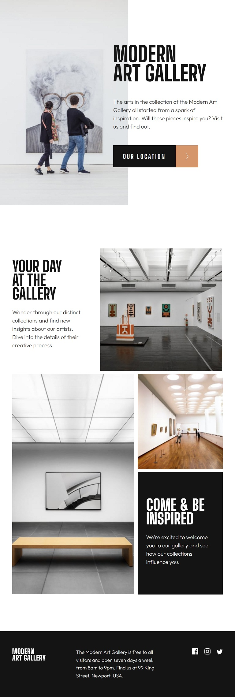
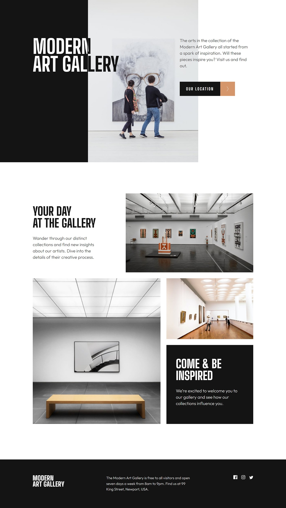

# Frontend Mentor - Art gallery website solution

This is a solution to the [Art gallery website challenge on Frontend Mentor](https://www.frontendmentor.io/challenges/art-gallery-website-yVdrZlxyA). Frontend Mentor challenges help you improve your coding skills by building realistic projects. 

## Table of contents

- [Overview](#overview)
  - [The challenge](#the-challenge)
  - [Screenshot](#screenshot)
  - [Links](#links)
- [My process](#my-process)
  - [Built with](#built-with)
- [Author](#author)

## Overview

### The challenge

Users should be able to:

- View the optimal layout for each page depending on their device's screen size
- See hover states for all interactive elements throughout the site
- **Bonus**: Use [Leaflet JS](https://leafletjs.com/) to create an interactive location map with custom location pin

### Screenshot

### Links

- Solution URL: [Frontend Mentor solution](https://your-solution-url.com)
- Live Site URL: [Live site at Netlify](https://your-live-site-url.com)

## My process

### Built with

- Semantic HTML5 markup
- Flexbox
- CSS Grid
- Mobile-first workflow

## Author

- Frontend Mentor - [@auriga2124](https://www.frontendmentor.io/profile/auriga2124)
- Twitter - [@ErkaRahman](https://twitter.com/ErkaRahman)
